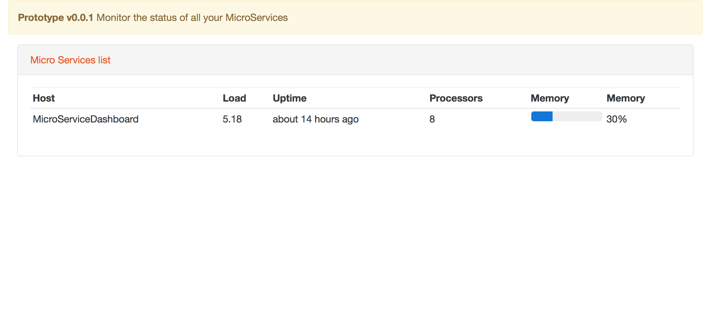

[](https://travis-ci.org/DashboardHub/MicroServiceDashboard)

# Dashboard for Spring Boot MicroServices and Actuator information

UI for Spring Boot Actuator Metrics - List your micro services and statistics

## Features

* Async / parallel calls to all your Actuator Microservices
* Websockets push to UI



## Deployment

Set ENV vars for MicroServiceDashboard to monitor itself

* `${SERVICE_ID_DEFAULT}`, eg. MicroServiceDashboard
* `${SERVICE_HOST_DEFAULT}`, eg. http://localhost:80/metrics

For **development**, these will default to

```
app:
  services:
    - id: MicroServiceDashboard
      host: "http://localhost:8084/metrics"
```
